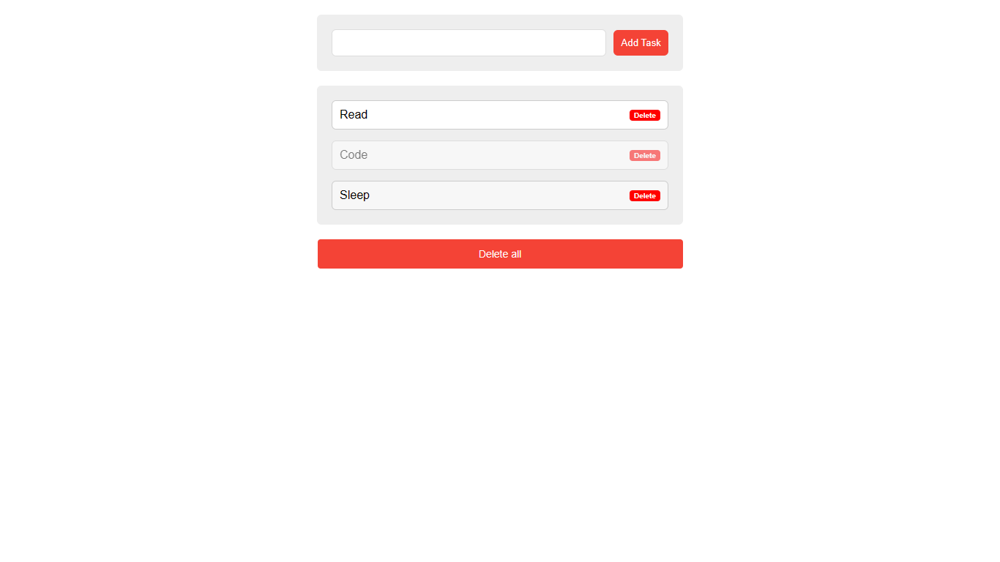

<h1 align="center">Todo App</h1>

  

This is a simple Todo app built using html, css, JavaScript and Node.js.

<h2>Features</h2>
<ul>
  <li>Add new tasks</li>
  <li>Mark tasks as complete</li>
  <li>Delete tasks</li>
  <li>View the list of tasks</li>
</ul>
<h2>Installation</h2>
<ol>
  <li>Clone the repository:</li>
</ol>
bash
Copy code
git clone https://github.com/weird-samuel/todo-app.git
<ol start="2">
  <li>Navigate to the project directory:</li>
</ol>
bash
Copy code
cd todo-app
<ol start="3">
  <li>Install the dependencies:</li>
</ol>
Copy code
npm install
<ol start="4">
  <li>Start the application:</li>
</ol>
Copy code
node app.js
<ol start="5">
  <li>Open your browser and visit <a href="http://localhost:4000">http://localhost:4000</a> to access the Todo app.</li>
</ol>
<h2>Usage</h2>
<ul>
  <li>To add a new task, enter the task description in the input field and click the "Add Task" button.</li>
  <li>To mark a task as complete, click the checkbox next to the task.</li>
  <li>To delete a task, click the "Delete" button next to the task.</li>
  <li>To view the list of tasks, simply open the Todo app.</li>
</ul>
<h2>Contributing</h2>

Contributions are welcome! If you have any suggestions or improvements, feel free to open an issue or submit a pull request.

<h2>License</h2>

This project is licensed under the <a href="LICENSE">MIT License</a>.

<h2>Acknowledgments</h2>
<ul>
  <li>This project was inspired by the need for a simple and lightweight fullstack Todo app.</li>
</ul>
<h2>Contact</h2>

For any questions or inquiries, please contact <a href="mailto:fiyinfoluwsamuel580@gmail.com">fiyinfoluwsamuel580@gmail.com</a>.

Happy task management!

